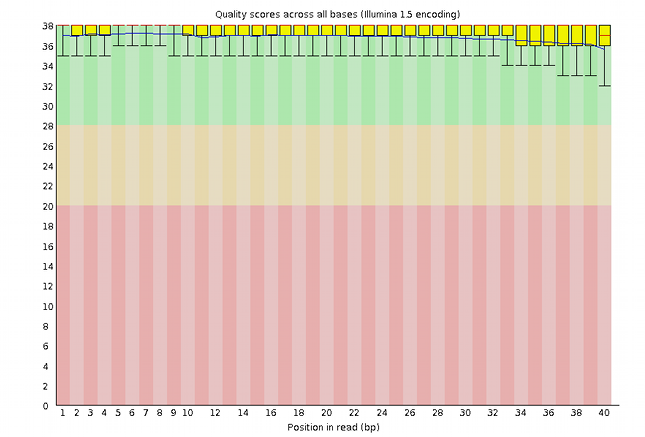

How to enhance data capture to produce more reliable records
============================================================

Capturing data in a laboratory is a daily operation that easily falls in routine chores. Something that can be a way to pile-up habits, both good and bad. Good data capture habits result in organised datasets in which one can find the means to reconstruct the capture itself, identify the instruments that were used, the reactants, the people intervening, etc. For a scientist, even if working alone, good datasets are an assurance that his/her attitude towards a rigorous relationship with the experiments started correctly. To the questions who, where, when and how (WWWH) did you get your data, one can exect to be able to answer unequivocally. That information needs to feed the annotation that is recorded together with the dataset at or near the data capture time.

It is relatively easy to produce and accumulate bad records and store bad datasets that have little or zero scientific value. Apparently good practices like keeping a lab-book, usually mandatory nowadays, are NOT a guarantee that experiments are properly recorded into datasets that allow anyone, including the original researcher, to fully address the WWWH questions, to start with. For example, a bad habit that apparently looks good is to record data in spreadsheets, occasionally print parts of spreadsheets on paper and glue tables in the lab-book. Easily the WWWH questions become unanswerable, the content of such a table becomes artificially dependent from other recorded information in the lab-book but it easily detaches from it with a simple annotation mistake. Highly dangerous, yet quite common practice. Worse than just being bad, it can "look" good, misleadingly!

### Data provenance
In Data Science, the the WWWH question is usually referred to as **provenance**. 

Provenance in data is tied not only to the Data Collection act but also to the its futher movements between databases. Provenance may or not entail ownership and licensing of its use. If the appropriate steps, as will be explained below, are taken, authenticated provenance implies authorship. To dig further, [[Buneman2000](../REFERENCES#Buneman2000)] is an interesting document about Data Provenance.

When Data Collection is performed via a service of some kind, such as the work from a Core Facility or Analytics provider, even more care must be put into fully describing the provenance. The reliability of a good provider is measurable, as described in the [reproducibility](../REPRODUCIBILTY) part of this course. This should not be confused with the reliability of a specific set of measurements. Here the evaluation of data quality should be intrinsic to each dataset, and taken into consideration in the analytical steps that follow.

For example, in a sequencing project, the final preparation of the samples and the actual running of the sequencing job is not usually in the hands of the experimentalist, and is handled by service personnel in a facility. The results of a sequencing run are usually handed to the requester via a usually large amount of files, either in a folder deposited in a server or in a hard disk that can be shipped. Either way care is taken to use standardised formats and keep data integrity. The fist thing that the experimenter should do is assess data quality and decide on a strategy to accept or reject records and to clean up the artifacts. 

### Data quality in DNA sequencing
In sequencing data, whichever instrumental platform is used, data quality will not be uniform and tends to be worse at least at the end of each read. This is the result of a natural penomenon that is tied to the measurement process. So, removing the tails of the reads, as much as removing traces from sequencing adaptors, for example, is a normal task that lies in the hands of the experimentalist. Data from a sequencing run can be inspected with a widely used public tool called `FastQC` produced at the Babraham Institute, Cambridge, UK. A very useful tutorial is provided at: https://www.bioinformatics.babraham.ac.uk/projects/fastqc/ 

A very good dataset can look like this:

Whereas a very bad dataset may look like this:
 

A program like FastQC can look at the dataset from a varietey of different perspectives, other than the above quality score and allows the experimenter to find support for accepting or rejecting a dataset and also to diagnose possible sources of disturbance, figuring out strategies to clean it up and checking for the effectiveness of such clean-up processes.

The above example shows an instance of data capture where, because we have large datasets in hands, a statistical assessment of quality may be comfortable or easy to perform. Also, this step in the provenance comes from a single machine, run by an identifiable team of professionals that, in principle, checks the ientire service provision regularly for the quality of the service itself. That is obvously not the case if we are dealing with field work, for example, where sample are collected by human agents that we barely know, over a large geographical area in a long period. It is very different if samples travel at different times and via different routes. It is very different if samples are measured with different instruments with different checking and calibrtation routines. In such cases, finding commonality is an issue, uncontrollable sources of variation in measurements can occur, even if we are only measuring weight with a scale or length with a ruler!

### Minimal information standards
In cooperative work, the need for adoption of standards and formats is even higher and simple things like the reliable time stamping of the datasets can serously compromise the accreditation of datasets. Likewise, as the result of serious efforts in standardisation, consortia have worked on the definition of stanadrdised ways of describing experiments, and managed to reduce their summarised information to minimum sets of descriptors. [[Brazma2001](../REFERENCES#Brazma2001)] and [[Taylor2007](../REFERENCES#Taylor2007)] are some examples  of such specifications.

This is only the tip of the iceberg. If you continue to dig ito this subject you will find that much more can be done to enhance not only the reliability, but also the traceability, for example. In any case, always keep original data and invest on its correct annotation and storage. 

### Negative data
It is quite common that data that is collected from experiments is not usable to prove working hypotheses. In fact, in some cases it would just disprove them. By convention we call it **negative data**. Unfortunately there is no common agreement on what to do with it, and in most cases it gets hiden from everybody else. Yet, it is quite obvious that it could play an important role  in avoiding useless experimentation and even bad hypothesis formulation. For the time being, responsible researchers should always keept this kind of data in repositories where it should be labelled as having been considered negative, and annotated just as any other dataset. Possibly awaiting reuse, negative data should not be discarded. 

Expected outcomes
-----------------
After exploring this module, you should be able to:
- Figure out how to collect and annotate datasets so that WWWH (who, where, when and how) questions can always be unequivocally answered.
- Document datasets so that provenance is uniquely assigned
- Assess data quality early, while it is being collected
- Locate and respect standards for minimal information about experiments
- Think about a strategy to deal with your own negative data
