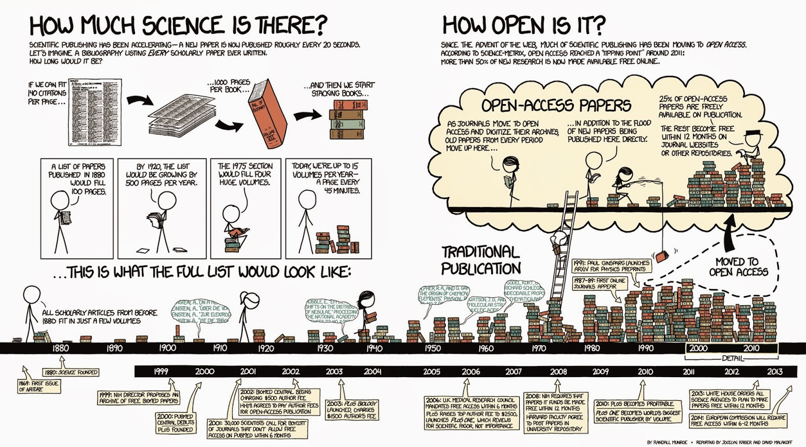

This module will show you ways to explore, organize and reference scientific literature of use to your research
===============================================================================================================
The number of scientific journals and the papers they publish keeps growing. Because a lot of this publishing only happens online, the limits to article lengths are also being adhered to less strictly. This has led to a situation where any normal human being can no longer keep abreast of the developments in their field simply by scanning "all" the relevant journals. Which ones are relevant? Which ones are nonsensical, or predatory? How to find what you need? How to get access to what you need? How to organize your own knowledge base? And how to do this collaboratively? Here we will address these questions and the principles behind them, illustrated by some current examples.

Searching the literature
------------------------
When you are just getting into a new research topic, you will want to develop an overview of the different publications that speak to this topic and discover which of these are open access. One tool that you might like to know about, the [open knowledge maps](https://openknowledgemaps.org/vis.php?id=0813a0b7df9325654116a3322c6d5961&query=metabarcoding&service=base) tool, shown in [example 1](#ls1) here gives an overview of the concepts related to the keyword "metabarcoding" and the 100 most relevant articles related to it, grouped by text similarity. The bubbles show the results of this clustering-by-similarity, and in each of these bubbles, the articles are shown (red icons are open access publications). As an exercise, now go to google and search with the same keyword. Notice how most of the results are not relevant papers, but any website that qualifies by google's proprietary algorithms, and no indication is given about openness.

_Example 1 (ls1) - querying the open knowledge map_

The example of the Open Knowledge Maps tool showed a very powerful technique that did not require you to have a great deal of rigour in composing your search terms: the tool did it for you. Under some circumstances, for example once you have learned more about the terminology used in a particular field, you may instead want to be more precise and specific and use commonly agreed-upon terms with an accepted meaning. One example of this is in the medical field, where so-called MeSH (Medical Subject Headings) terms are commonly used in composing search queries in the medical literature. 

### Medical Subject Headings (MeSH)
MeSH terms are defined in a [controlled vocabulary](https://en.wikipedia.org/wiki/Controlled_vocabulary) and their meanings organised by the higher concepts they belong to. For example, by perusing the concept hierarchy for the MeSH term [DNA Barcoding, Taxonomic](https://www.ncbi.nlm.nih.gov/mesh/68058893), we discover there are actually two meanings:

1. a technique for typing organisms by matching against a reference database of marker sequences, or
2. the lab technique where such a specific marker (e.g. COI) is amplified and sequenced

If, for example, we only wanted to retrieve publications from pubmed.gov that match the first definition, we would compose the query as follows:

    "dna barcoding, taxonomic"[MeSH Terms] "Sequence Analysis, DNA"[Mesh:NoExp] 

This query gives, at time of writing, only 537 high-relevance results, whereas searching for `dna barcoding` yields 3278. Among these results is, for example, a paper about the application of DNA barcoding to faecal samples of birds. If we click on that hit we are taken to a [page](https://www.ncbi.nlm.nih.gov/pubmed/25572526) that displays the abstract. 

Retrieving papers in PDF
------------------------
Assuming that we are interested in the aforementioned paper, we might want to follow up and go to the publisher website, whose link is displayed in the top right of the page. However, depending on where you currently are (e.g. you might be at home, where you don't have institutional access) you might not be able to retrieve the PDF, which is reserved to subscribers, institutional or otherwise. To circumvent this issue, as of time of writing, a perfectly legal browser plugin has become very popular: [unpaywall](http://unpaywall.org/). This plugin exploits the fact that certain people (such as the authors of a publication) are generally acting within their rights if they make a PDF of their paper available elsewhere. The plugin discovers these alternative locations and re-directs you to it. 

If you haven't already, please install the [unpaywall plugin](http://unpaywall.org/) that matches your browser, and then click on the publishers link on the top right of the  [pubmed entry](https://www.ncbi.nlm.nih.gov/pubmed/25572526). You should now see a green, open padlock icon somewhere on the screen (precisely where differs a little between browsers). If you click on it, the PDF file will be downloaded. Magic!

Another browser add-on that may help you locate a PDF version of an article is the [google scholar button](https://scholar.google.com/scholar_settings#4), which lets you use a highlight phrase as a search term and then locate all the versions of a matching publication that are on the web. This often helps to find PDF versions that authors have posted, for example, on [ResearchGate](http://researchgate.net).

Managing your literature
------------------------
Now that you have started locating papers and downloading PDFs you might be interested in organising a local repository. It is no good to simply dump all PDFs in a folder and write down literature references in a list by hand: there are much better ways to manage this information, that also give you the possibility of sharing. Various tools exist for this; some of the commonly used ones are:
- [Mendeley](http://www.mendeley.com/)
- [Zotero](http://www.zotero.org/)
- [Papers](http://papersapp.com/)
- [EndNote](http://endnote.com/)

At present, the most popular of these is probably Mendeley. It has several virtues: similar to the unpaywall bookmarklet, there is also a mendeley bookmarklet that allows you to import a citation entry from a variety of search engines (such as pubmed) as well as publisher webpages with a single button press; it allows you to make shared bibliographies that you can organise collaboratively; it has a plug-in for Microsoft Word that allows you to insert literature citations directly into the manuscript that you are working on, which then will be formatted according to the selected citation style.

To make this work across computers and within research collaborations, you will need to install the Mendeley desktop application on each of the participating computers (whether your own or of a collaborator). The application will then synchronise bibliographies and PDFs across these installations on request. This way, you and your collaborators all around the world can assemble a shared collection of relevant literature.

> To give you an idea of how this works in practice, here is the workflow that we followed when we wrote these pages:
> 1. We collected references using the [Mendeley browser bookmarklet](https://www.mendeley.com/reference-management/web-importer), which resulted in a [public library](https://www.mendeley.com/community/osodos/). We then made sure in [Mendeley Desktop](https://www.mendeley.com/download-mendeley-desktop/) that every reference has an author, year, title, journal, and doi. We also made sure that all authors only had initials in their first names.
> 2. We  exported the library to a [bibtex file](https://github.com/Pfern/OSODOS/blob/master/assets/references.bib)
> 3. We wrote a [script](https://github.com/Pfern/OSODOS/blob/master/src/bib2markdown.py) that converts the bibtex file to a list of references in Markdown, the format in which these pages are written.
> 4. In the various pages, we then cited the references by their bibtex key, creating a clickable link to the list of references, using syntax such as: `[Zhang2014](../REFERENCES#Zhang2014)`

Accomplishments
---------------
You have now had a chance to look at practical ways of exploring scientific literature. By now, you should be able to:
- Discover relevant literature
- Manage your literature
- Share literature with collaborators
- Insert citations in manuscripts
- Generate correctly formatted bibliographies
- Work around some limitations 
