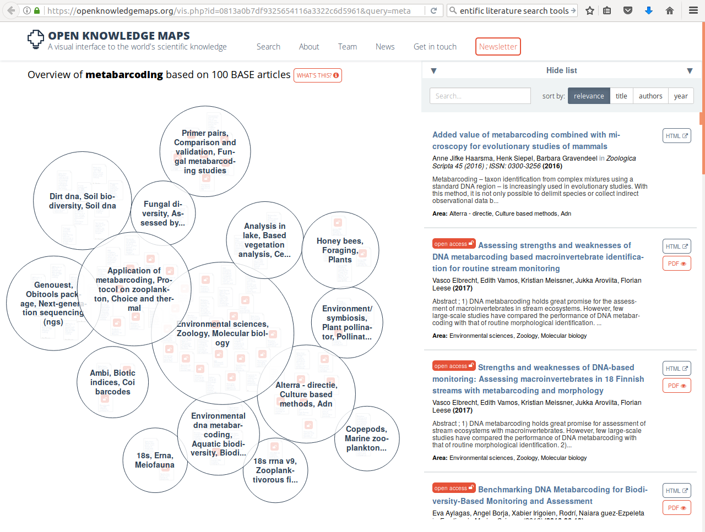

This module will show you a way to explore, organize and reference scientific literature of use to your research
----------------------------------------------------------------------------------------------------------------
The number of scientific journals and the papers they publish keeps growing. Because a lot of this publishing
only happens online, the limits to article lengths are also being adhered to less strictly. This has led to
a situation where any normal human being can no longer keep abreast of the developments in their field simply
by scanning "all" the relevant journals. Which ones are relevant? Which ones are nonsensical, or predatory?
How to find what you need? How to get access to what you need? How to organize your own knowledge base? And 
how to do this collaboratively? Here we will address this questions and the principles behind them, illustrated
by some current examples.

When you are just getting into a new research topic, you will want to develop an overview of the different
publications that speak to this topic and discover which of these are open access. One tool that you might like
to know about, the 
[open knowledge maps](https://openknowledgemaps.org/vis.php?id=0813a0b7df9325654116a3322c6d5961&query=metabarcoding&service=base) 
tool, shown in [example 1](#LS1) here gives an overview of the concepts related to the keyword "metabarcoding" 
and the 100 most relevant articles related to it, grouped by text similarity. The bubbles show the results of this 
clustering-by-similarity, and in each of these bubbles, the articles are shown (red icons are open access 
publications). As an exercise, now go to google and search with the same keyword. Notice how most of the results
are not relevant papers, but any website that qualifies by google's magic, proprietary algorithms, and no 
indication is given about openness.

#LS1

- use clever query tools to discover relevant literature (example: open knowledge maps, go pubmed, google scholar)
- use a tool to manage your literature locally (e.g. mendeley desktop to watch PDF folder, enrich database with DOIs)
- use an open source tool to assemble relevant literature in a shared bibliography (example: mendeley groups)
- don't enter relevant literature by hand in the bibliography (example: bookmarklet, unpaywall)
- don't enter citations by hand into whatever article you're writing (example: word plugin)
- use the appropriate template for the citation style (example: insert bibliography with style)
DOIs ORCID

You have now had a chance to look at practical ways of exploring scientific literature. By now, you should be
able to:
- discover relevant literature
- manage your literature
- share literature with collaborators
- insert citations in manuscripts
- export correctly formatted bibliographies
- work around some limitations 
