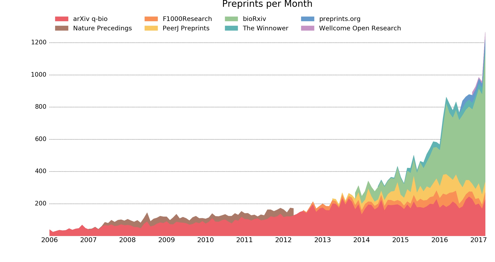
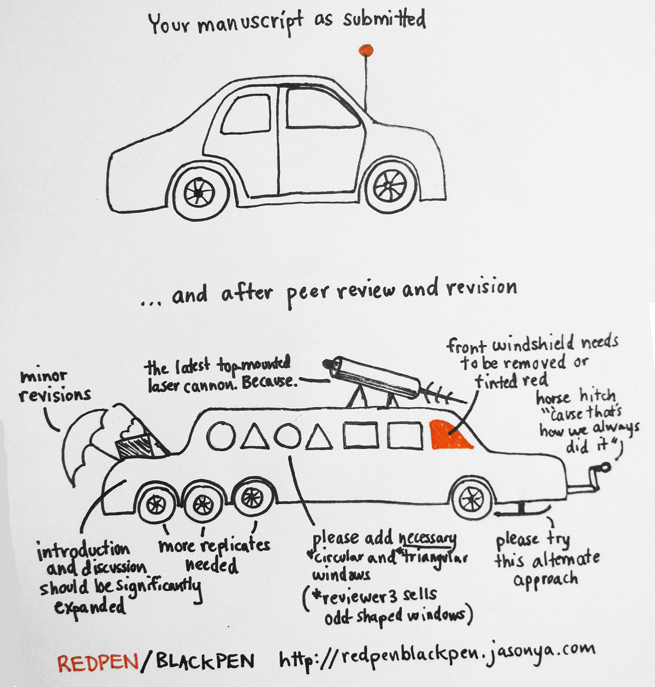
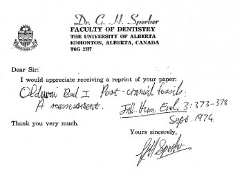

How to publish a scientific article that gets read
==================================================
Elsewhere in these materials we discuss technological solutions and logical
principles for [how to study the scientific literature](../LITERATURE_STUDY) and 
[how to edit and revise a manuscript](../VERSIONING) collaboratively. The next
challenges will be to write something good and publish it such that it is most
likely to be read, cited, and otherwise recognised. Scientific writing is both
a creative exercise in logical exposition and rhetoric as well as a highly rigid
following of established rules for document structure and jargon usage. Practice
makes perfect, but here are some potentially useful guidelines:

- **Zhang, W.** 2014. Ten simple rules for writing research papers. 
  _PLoS Computational Biology_ 10(1):e1003453 
  [[pdf](writing_research_papers.pdf)]
  doi:[10.1371/journal.pcbi.1003453](http://doi.org/10.1371/journal.pcbi.1003453)
- **Weinberger, C.J., Evans, J.A. and S. Allesina** 2015. Ten simple (empirical)
  rules for writing science. _PLoS Computational Biology_ 11(4):e1004205
  [[pdf](writing_science.pdf)]
  doi:[10.1371/journal.pcbi.1004205](http://doi.org/10.1371/journal.pcbi.1004205)

The scholarly publishing cycle
------------------------------
### Preprints
Assuming you have managed to draft a manuscript collaboratively into a state you 
all agree is ready to be sent out into the world, the next question is then 
where it will go. As the chart below shows, it is becoming increasingly common 
(and in more and more of the natural sciences) to send a manuscript to a 
[preprint](https://en.wikipedia.org/wiki/Preprint) server, such as 
[arXiv](http://arxiv.org), [PeerJ Preprints](https://peerj.com/preprints/),
and [biorXiv](http://biorxiv.org). 

_Example 1 (p1) - Growth in preprint servers (source: Jordan Anaya)_

When you upload your manuscript to such a server, it will not be type set - so 
this is your chance to make a pretty PDF. What may happen is that a human on the 
other end will do some checks to see if what you uploaded is indeed a scholarly 
manuscript and that you have the right to post there (i.e. it is not
copyrighted somehow), but it will not be peer reviewed. What, then, is the
purpose of this? Here is an [introductory video](https://youtu.be/2zMgY8Dx9co)
created by [asapbio](http://asapbio.org/), _a scientist-driven initiative to 
promote the productive use of preprints in the life sciences._

Your preprint will be the first version of your manuscript that is publicly 
accessible and uniquely identifiable to anyone on the web. It will likely be 
assigned a [digital object identifier](https://en.wikipedia.org/wiki/Digital_object_identifier) 
or DOI.

### Peer review
Subsequent to, perhaps, an upload to a preprint sever, you will submit your 
manuscript for peer review and publication in a journal. During this process you 
will most likely:

1. Prepare and upload a package that consists of your manuscript (double-spaced, 
   with line numbers), the illustrations and any supplementary data in separate 
   files, and a cover letter where you explain to the editor the importance of 
   your manuscript for the readership of the journal you are targeting.
2. Receive reviews where two or more, usually anonymous, colleagues give 
   feedback on your manuscript. This is usually at least one page per reviewer,
   consisting of remarks on the substance of your work as well as nitpicking
   about typos, phrasing, things you really ought to cite, and so on. These
   reviews will be accompanied by an editorial decision. The best you can 
   reasonably hope for is _accept with minor revisions_, which means you 
   probably will not have to do additional experiments or analysis, just 
   rewriting. _Major revisions_ means more work, which therefore means it will
   take a lot longer for the manuscript to be finally published. Because 
   publishers want to avoid showing a long timespan between initial submission 
   and publication (this is usually somewhere on the first page of an article) 
   it appears to become more common to get _reject with resubmission_
   instead, which also means more work and a "reset" on the ticking clock from
   the publishers perspective. Most disheartening of all is a rejection where
   the editor does not want to see this manuscript resubmitted again. This is
   usually simply because your manuscript was not appropriate for that journal.
3. Draft your response to the reviewers and revise your manuscript. You should
   respond somehow to all of the remarks made by the reviewers. Sometimes the
   remarks will genuinely be helpful and improve your manuscript. Anything 
   trivial requested by a reviewer you should just do outright so that you build 
   up some credit with the final arbiter, the editor, for the parts where you 
   may have to argue or refuse to do something: reviewers can be wrong, or 
   unreasonable, so you might not be able to satisfy them in every respect.
4. After one or more rounds of review, receive the final verdict. If it was 
   accepted, you will then receive page proofs that you will need to check very
   carefully, because this is how your paper will look in print. You will return
   the annotated page proofs, and, perhaps, a signed statement where you 
   transfer copyright to the publisher. Also, you will most likely have to pay:
   for colour figures and other expenses associated with making a "pretty" 
   publication, but possibly also for _open access charges_, which are discussed 
   in more detail in the next section.
   

### Open access
The scholarly publishing model has undergone very little change over the last
three hundred years, despite that fact that means of communication have changed 
enormously. Once upon a time, people had full jobs picking the letters (that is,
pieces of lead) of an article one by one from wooden cases: the upper cases in 
front of them had the capital letters. Stacking the letters line by line and 
then page by page, this _type setting_ was laborious and therefore costly. Then,
the article was printed on paper, and this printed paper was shipped around the 
world. Needless to say, readers needed to pay for all this work and material. 
It is not so obvious why this is still the case in an age of desktop publishing 
and internet communication; nor is it particularly justifiable that the general 
public first finances the research at public institutions out of their taxes, 
and then has to pay again to read the results. Enter _open access_ (OA) 
publishing.

The idea behind open access publishing is that everyone should be able to read 
scientific publications without hindrance. To accomplish this, there are,
broadly speaking, two models. "Green" OA simply means that you, the author, 
often have the right to share your article with others. Even in the olden days,
authors would get - or buy - a pile of "reprints" of their article that they 
could mail to interested readers (who would make their interest known by sending 
the author a special "reprint request card"). In the age of PDFs, authors can
- and usually may, often after some period imposed by the publisher - upload 
these to their personal website, to an institutional repository, or to their web 
page on, for example, [ResearchGate](http://ResearchGate.org). The latter 
website is one of the locations where the Unpaywall plugin discussed in the 
section on [literature study](../LITERATURE_STUDY) often finds free versions of 
articles.

_Example 2 (p2) - [Ye olden days, when scientists were always "Sirs", apparently](https://cashp.columbian.gwu.edu/good-old-days)_

"Gold" OA means that the author pays the publisher to make the article 
immediately freely available on their website. Because publishers then lose
the ability to charge readers for the article, they attempt to essentially 
recoup this from authors. Hence, _open access charges_ usually exceed $1000.

### Enhanced publications
The previous sections may have painted a somewhat negative picture of the 
scholarly publishing business. This does not mean that there is no useful place 
for publishers, and that there is nothing they can do to enhance scientific
publications beyond "type setting". Here are some examples of the value that can
be added to scientific articles by publishers:

- **Semantic annotations** - many scientific articles contain terms that 
  originate in some sort of [controlled vocabulary](../SEMANTICS), such as gene 
  names, species names, chemicals, and so on. Some publishers have started to
  provide services that automatically annotate articles with recognised terms.
  For example, the [Biodiversity Data Journal](https://bdj.pensoft.net/) does
  this for species names.
- **Machine readable publications** - the language in some scientific articles 
  is structured so rigidly that it is, or could be made, machine readable. An
  example of this lies in taxonomic descriptions of species (such as in 
  [floras](https://en.wikipedia.org/wiki/Flora_(publication))): in a recent 
  study, such descriptions were read by scripts and converted to 
  [an ontology](http://doi.org/10.1186/s13326-016-0107-8). An ongoing initiative
  to make taxonomic publications machine readable for such purposes is 
  offered by [Plazi](http://plazi.org/resources/treatmentbank/goldengate-editor/).
- **Enhanced PDFs** - PDF files can contain more than just formatted text and
  figures: they can be enhanced with interactive visualisations (including 3D),
  clickable links, and so on. Some publishers (such as
  [nature](http://www.nature.com/news/announcement-nature-papers-enhanced-1.13125))
  are now offering enhanced PDFs with such interactive features.
- **Executable publications** - some articles contain a lot of 
  [computational analysis](../WORKFLOWS) that could be presented in a
  [re-runnable](../REPRODUCIBILITY) form. For example, here is 
  [a paper](http://doi.org/10.1101/gr.094508.109) whose analysis can be re-run
  as a Galaxy workflow. In [another example](http://doi.org/10.22541/au.149693987.70506124),
  the infographic and its underlying data and analysis are available as Jupyter
  notebook.

Getting cited and making it count
---------------------------------
The currency with which scientists recognise each other's work is citations. How
to get cited? The best way to get cited is to do interesting, novel work. The
next best way is to present your work in a clear and appealing way, using a good
title, a clear abstract and the right keywords. Some content in your article may
be discouraging, such as poor writing, or unnecessary but intimidating formulae.
Other good ways to get cited are to make your article and any associated 
[data](../DATA_SHARING) and [computational workflows](../WORKFLOWS) freely
available: a 
[recent study](https://figshare.com/articles/Nature_Communications_dataset/1108068) 
showed that open access publications are cited more often.

A contentious issue in establishing the supposed quality of a scientist's work
is the "impact factor" of the journals that the work gets published in. Although
as a metric it is [criticised](http://biorxiv.org/content/early/2016/07/05/062109),
it does try to capture something meaningful: some journals are read and cited 
much more than others. Scientists want to publish in those journals, which 
forces the journal to become more selective, making it that much more of an
accomplishment if you do make it through and get published in, say, _Nature_.

Apart from doing good, open science and publishing it in high-impact journals 
there are also some practical steps that you might consider to increase 
citations. For example, it is important that you make it clear which version of 
your article should be cited. The cumbersome nature of the scholarly publishing 
cycle, with potentially many versions of an article floating around on cloud 
services, preprint servers, indexing databases and publisher websites, creates 
the need for clear, unambiguous, globally unique identifiability of manuscripts.
The DOI was invented for this purpose, and tools such as reference managers 
(e.g. Mendeley) make use of it to locate the "correct" metadata associated with 
this article. You should therefore make sure that the right DOI is used. For 
example, if you uploaded an earlier version to a preprint server, you should 
make sure that people using the DOI issued for that preprint version will be 
able to locate the "final" version. This might mean that the record on the 
preprint server needs to be updated to point to the "final" DOI. 

The next step towards being credited correctly for your work is being 
identifiable. Citations are tracked by automated processes (such as 
[Web of Science](http://ipscience.thomsonreuters.com/product/web-of-science/) 
and [Google Scholar](http://scholar.google.com)) that scan the literature for
citations to your work and compute metrics such as the 
[H](https://en.wikipedia.org/wiki/H-index) index. If these automated processes 
encounter multiple, different versions of your name, e.g. because you got 
married and took on your spouse's name, or you have middle names, then some 
citations might not flow towards you but to your alias. This is one of the 
reasons why systems such as the [ORCID](https://en.wikipedia.org/wiki/ORCID), 
which identifies researchers with an identifier that can be attached to
publications, have come into usage.

