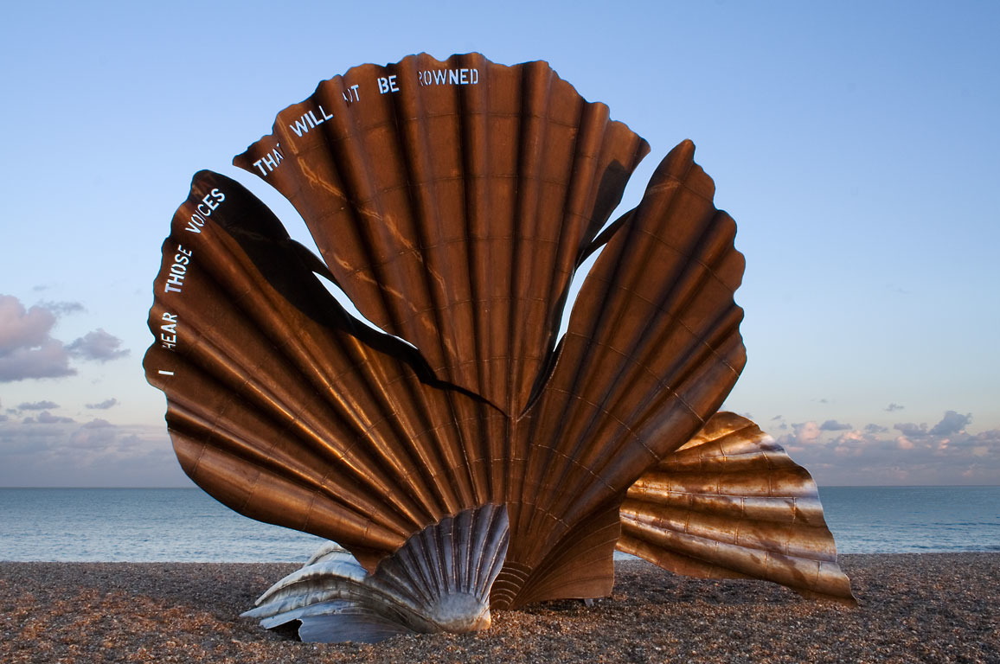

<h1 style="text-align:center">Open Science, Open Data, Open Source</h1>
<h2 style="text-align:center">21st century research skills for the life sciences</h2>

<em>Pedro L. Fernandes</em> and <em>Rutger A. Vos</em>

Produced in Oeiras and Paço de Arcos, Portugal. June and September 2017

----

Disclaimer
----------

This work is licensed under the Creative Commons Attribution 4.0 International License. To view a copy of this license, visit http://creativecommons.org/licenses/by/4.0/ or send a letter to Creative Commons, PO Box 1866, Mountain View, CA 94042, USA.

----

