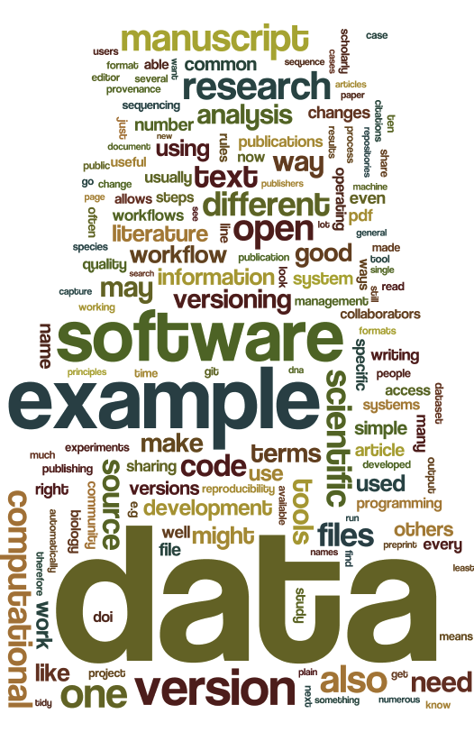

Open access, open data, open source
===================================
_In silico_ research skills for the life sciences
-----------------------------------------------

Contents
--------
### Science
- [Coping with the literature](LITERATURE_STUDY)
- [Managing change](VERSIONING)
- [Publishing](PUBLISHING)
### Data
- [Collecting data](DATA_CAPTURE)
- [Reproducibility](REPRODUCIBILITY)
- [Data sharing](DATA_SHARING)
- [Data management](DATA_MANAGEMENT)
### Source code
- [Scientific software](SCIENTIFIC_SOFTWARE)
- [Computational workflows](WORKFLOWS)
- [Interoperability and integration](SEMANTICS)

Who is this for?
----------------
### Graduate students

### Lab technicians

### Data scientists

### Principal investigators

### Publishers

Disclaimer
----------

This work is licensed under the Creative Commons Attribution 4.0 International License. To view a copy of this license, visit http://creativecommons.org/licenses/by/4.0/ or send a letter to Creative Commons, PO Box 1866, Mountain View, CA 94042, USA.
