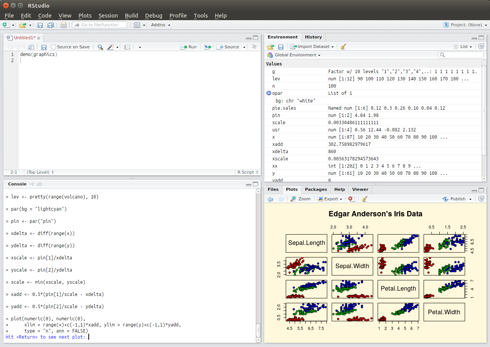
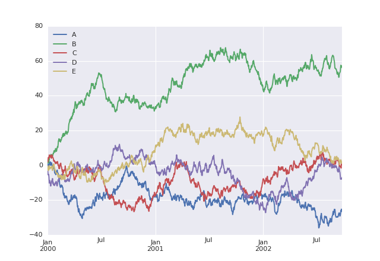

This module will show you ways to improve scientific software code and script development
=========================================================================================
Research in the life sciences is increasingly [computational](https://doi.org/10.1371/journal.pbio.2002050), which, 
because all research is about expanding what is known, means that the development and application of new 
computational methods is part of the field. Even if you are primarily a bench scientist or a field worker, you should 
have some awareness of scientific computing. How is software code written and how can you do this collaboratively? 
How does one use the code of others? How do you share your own? How to improve your code, and make it verifiable and 
testable? Here we will address these questions and some of the approaches and community standards that are in current 
usage.

Picking the right tools
-----------------------
All source code, and a lot of research data (molecular sequence data, tabular data, analysis logs, etc.), consists of 
plain text files. Programs that are intended for composing prose and tables for human readers (such as Microsoft 
Word and Excel) are wholely unsuitable for operating on such text files: they might do things such as automatically 
convert "simple" quotes to “smart” ones, which might invalidate your data; convert between different, local 
conventions for decimal points, which are commas in some countries; attempt to run spell checks on data, which 
clutters the screen with useless information; attempt to export to proprietary file formats. 

### Text editors
Because of the aforementioned problems with using word processors to edit plain text, the first, right tool to
either locate on your computer or install if it isn't there, is a [text editor](https://en.wikipedia.org/wiki/Text_editor).
There are good, free, lighweight editors for every operating system, for example:

- On Windows there is [notepad++](https://notepad-plus-plus.org/) and [editpad](https://www.editpadlite.com/)
- On OSX there is [BBedit](https://www.barebones.com/products/bbedit/)
- On Linux there are numerous options, [gedit](http://www.gedit.org/) being a common one on GNOME, for example

Aside from plain text data files, text editors are also useful for working on source code. In many cases, a text editor
will recognise the programming language (for example by the file extension of the source code file, e.g. `*.py` for
python and `*.R` for R) and will colorise the syntax accordingly and allow blocks of code to be collapsed or expanded.
However, for any project that comprises multiple files - and this is nearly always the case, if we consider input and
output data files, configuration files, as well as source code - a text editor will not suffice. Hence, the next, right
tool for the job will be an [integrated development environment](https://en.wikipedia.org/wiki/Integrated_development_environment)
or IDE.

### IDEs
An IDE allows you to organise sets of files into projects such that the dependencies between the files are managed. An
IDE will typically have a deeper understanding of the programming language you are using, so that it may spot problematic
syntax and logic errors, and may suggest functions and variables for code completion. Also, an IDE will allow you to execute
your code line by line, which helps in localising problems and in stepping through an analysis workflow. Lastly, an IDE
will be able to visualise different things, such as complex data structures.

_Example 1 (ss1) - the graphical user interface of the most popular integrated development environment for R, RStudio. The
top left pane organises files, the bottom left pane [evaluates R statements line by line](https://en.wikipedia.org/wiki/Read%E2%80%93eval%E2%80%93print_loop)
 (e.g. to test out commands), the top right pane visualises complex data structures, and the bottom right pane allows for
viewing various things such as help documentation or statistical plots._

Just like text editors, numerous IDEs exist. For most programming languages there are very good, free options. For example,
for the R language for statistics there is [RStudio](https://www.rstudio.com) (shown in [example 1](#ss1)), for Python 
there is [pycharm](https://www.jetbrains.com/pycharm/), for Java there is [eclipse](https://www.eclipse.org/), and so on.

A slightly different take on source code development that is more geared towards analysis workflows than to application
development is provided by the [literate programming](https://en.wikipedia.org/wiki/Literate_programming) paradigm. In this
way of working, source code is primarily a prose document, interspersed with bits of executable code and dynamic 
visualisations. This is found in R programming in the guise of [RMarkdown](http://rmarkdown.rstudio.com/) (an example of
this is the [working document](https://github.com/ropensci/RNeXML/blob/master/manuscripts/manuscript.Rmd) that formed the
basis of [the publication for the RNeXML library](http://doi.org/10.1111/2041-210X.12469)). The [Jupyter](http://jupyter.org/) 
system facilitates the same way of working but accommodates more programming languages.

_Example 2 (ss2) - example output of the modified "Welcome to Python" notebook._

As an exercise of literate programming, try the [Welcome to Python](https://try.jupyter.org/) notebook. Modify the code to draw
five (instead of four) curves, labeling the additional one `E`. An example of what the expected output might look like is 
shown in [example 2](#ss2), but keep in mind that these curves are randomly generated so they will look different every time.

Working with others
-------------------
Like most aspects of scientific research, scientific software development is becoming increasingly collaborative, which means
that developers of software code and analytical workflows are increasingly participating in [open source development](https://en.wikipedia.org/wiki/Open-source_software_development).
There are numerous idealistic reasons for why this ought to be done (for example, because computational analysis is a
research method and so should be transparent in order to be reproducible; or, because scientific software is typically 
funded publicly, it should be freely available) but there are also very practical, self-interested reasons for adopting 
open source. The main ones of these are that it allows you to build on the shoulders of others, e.g. by re-using software
components developed and published by others, and that it allows you, in turn, to have greater impact with your work, 
because others will use it (and cite it) in turn. To participate in open source developments, here we discuss some of the 
main aspects to consider.

### Community conventions
Every community of open source developers, whether it's a community centred around a programming language or a problem 
domain (like bioinformatics), has its own conventions. Some of these may be well-considered and useful, such as documentation 
standards, while others may be somewhat arbitrary, such as debates about what is or is not "pythonic" - while some community 
conventions might even be actively harmful, like the perverse pleasure in writing deliberately cryptic, obfuscated code. If 
you want to start contributing to a community, learn about the conventions that have been adopted, especially insofar as they 
affect collaboration. For example, learn what is expected of a software package that you plan to contribute: how do the files 
need to be organised? How does the code need to be structured? Are there specific 
[design patterns](https://en.wikipedia.org/wiki/Software_design_pattern) that ought to be followed? 

### Rights and licenses
Open source software is also referred to as "free software". This does not just mean in the sense of "free beer", i.e. at no 
cost, but also - more importantly - in the sense of "free speech". In other words, open source has to do with the rights of 
people to intellectual property. These rights are defined in software licenses, and they are relevant to developers because 
they both concern what you can do with the software developed by others (e.g., under what conditions, commercial or otherwise, 
can you re-use somebody else's source code) and what others can do with the source code that you write. Whereas the 
[creative commons](https://creativecommons.org/) licenses are typically used for works such as images, text (including scholarly 
publications) and data sets, open source software is usually released under one of the licenses recognised by the 
[open source initiative](https://opensource.org/).

### Responsive communication
Collaborative development and participation in a community also means to respond to feedback from others at every stage of the 
development cycle. When you are first planning a software tool or a computational workflow you will need to 
[learn what your collaborators think the requirements are](https://en.wikipedia.org/wiki/Requirements_elicitation);
when you have a prototype or an early version you may need to 
[adjust your approach in response to early user testing](https://en.wikipedia.org/wiki/Agile_software_development); once
you have released something you may need to [manage and address issues](https://en.wikipedia.org/wiki/Issue_tracking_system) 
reported by users.

Some of the challenges of working collaboratively can at least partly be addressed (or facilitated) by technology. Specifically,
collaborating on anything that changes over time, whether a manuscript, data, or source code, can be facilitated by technologies
that track version changes, a topic that is dealt with in more detail in [another section](../VERSIONING).

Developing robust, verifiable software
--------------------------------------
Most scientific software is not developed by professional software engineers but by researchers. In general, such software
is highly innovative in terms of the application of new analytical techniques, but also very fragile and difficult to use.
Numerous specific recommendations to address these issues can be made (below, we link to two documents each with ten simple 
rules regarding this), but one of the key principles on all of this is the need for a structured approach to software testing
using (valid and invalid) data. 

In every programming language in common usage in scientific computing there are helpful tools to automate testing. What these
do, in general, is to run small programs or commands that you developed in addition to the main software to test its functioning.
By adopting one of these conventional testing tools, you will gain numerous advantages:

- Users can see the software in live action. This will aid them in verifying that the installation succeeded, and they will
  see what the inputs and outputs (in terms of data, commands, and parameters) should look like, i.e. this will make the
  software self-documenting.
- Sets of tests can be integrated automatically in [systems](https://en.wikipedia.org/wiki/Continuous_integration) that run 
  periodically (for example, every time a [version change is recorded](../VERSIONING)) to verify that the system still functions 
  as intended.
- If you make major changes in the architecture of the software you can verify automatically that this change did not break
  anything.

For further reading on these and related topics, you may be interested in:

- **Taschuk, M. and Wilson G.**, 2017. Ten simple rules for making research software more robust.
  _PLoS Computational Biology_ 13(4):e1005412 [[pdf](Ten_simple_rules_for_making_research_software_more_robust.pdf)]
  doi:[10.1371/journal.pcbi.1005412](https://doi.org/10.1371/journal.pcbi.1005412)
- **List, M., Ebert, P. and Albrecht, F.**, 2017. Ten simply rules for developing usable software in computational biology.
  _PLoS Computational Biology_ 13(1):e1005265 [[pdf](Ten_simple_rules_for_developing_usable_software_in_computational_biology.pdf)]
  doi:[10.1371/journal.pcbi.1005265](https://doi.org/10.1371/journal.pcbi.1005265)

Accomplishments
---------------
You have now had an encounter with some of the principles, tools and techniques that play a role in scientific software
development. You should now be able to:
- Understand why to use a text editor for plain text files
- Understand what the purpose is of an IDE
- Modify and execute a simple workflow
- Know some of the principles of open source development
- Know the purpose of software testing in scientific computing
