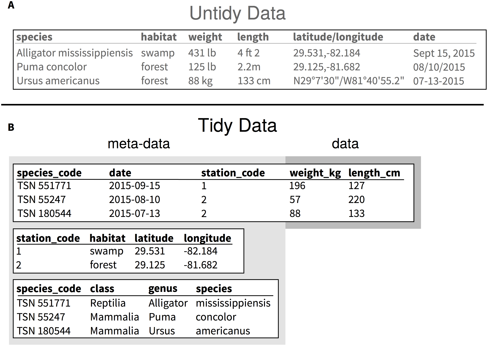

Be explicit about what you mean in your data, and use common terminology and standards
======================================================================================
In a number of locations in these pages we refer to cases where there is a common understanding
among stakeholders of the meaning of certain terms. For example, in discussing 
[community conventions in open source software development](../SCIENTIFIC_SOFTWARE#community-conventions),
certain specific keywords are used in package names and metadata files describing packages; in the issuing 
of [version numbers](../VERSIONING#version-numbers) for software, where the different parts of a version 
number contain embedded meaning about how one version differs from the next; in literature search, where 
search terms might be anchored to specific interpretations, as in the case of 
[MeSH terms](../LITERATURE_STUDY#medical-subject-headings-mesh); in the description of experiments, where 
[minimal information standards](../DATA_CAPTURE#minimal-information-standards) define checklists of what 
to report about an assay. These are all instances where a community has defined the
[semantics](https://en.wikipedia.org/wiki/Semantics) of terms, usually for the purpose of integrating 
information (articles, software) from different sources. In an open world where we want to share our 
research output with others and others to use our data in turn, similar challenges (and solutions) arise 
when integrating research data. Here we will discuss some of the general principles to guide is in making
our data more amenable to integration.

How to structure data
---------------------
Sometimes your data is [captured](../DATA_CAPTURE) by a machine in such a way that you might never edit
it "by hand" and it is automatically structured according to community standards (such as 
[FASTQ](https://dx.doi.org/10.1093/nar/gkp1137) in the case of high-throughput DNA sequencing). In other
cases, you might collect and collate data by the hand, for example in the field, or while scanning
through the literature or perusing online resources. A common approach is then to enter data in a 
spreadsheet. In this, there are certainly tidy and untidy ways to do this.

Consider [example 1](#s1). _Dataset A is untidy because it mixes observational units (species, location of 
observations, measurements about individuals), the units are mixed and listed with the observations, more 
than one variable is listed (both latitude and longitude for the coordinates, and genus and species for the 
species names), and several formats are used in the same column for dates and geographic coordinates. 
Dataset B is an example of a tidy version of dataset A that reduces the amount of information that is 
duplicated in each row, limiting chances of introducing mistakes in the data. By having species in a 
separate table, they can be identified uniquely using the Taxonomic Serial Number (TSN) from the Integrated 
Taxonomic Information System (ITIS), and it makes it easy to add information about the classification of 
these species. It also allows researchers to edit the taxonomic information independently from the table 
that holds the measurements about the individuals. Unique values for each observational unit facilitate 
the programmatic combination of information using "join" operations. With this example, if the focus of the 
study for which these data were collected is based upon the size measurements of the individuals (weight 
and length), information about "where", "when", and "what" animals were measured can be considered metadata. 
Using the tidy format makes this distinction clearer._ (reproduced from 
[Hart et al., 2016](https://doi.org/10.1371/journal.pcbi.1005097))

Assuming you follow the advice from Hart et al. faithfully, your next decision will be what file format to store 
your data in. Although you might be very productive in a spreadsheet editor such as Microsoft Excel, resist the
temptation to store your data in Excel's proprietary file format (`.xls` or `.xlsx`). Not only is Excel 
format readable by fewer programs than a plain text format such as 
[tab-separated values](https://en.wikipedia.org/wiki/Tab-separated_values), which reduces the ways in which
the data can be re-used without further conversion, the risk that your data will be unintentionally altered 
(corrupted) by Excel is very real:
[gene name errors (because of this) are widespread in the scientific literature](http://doi.org/10.1186/s13059-016-1044-7).

The point of structuring your data in "tidy" form as tabular, plain text will be immediately obvious once you 
(or your collaborators, or people using your data) try to analyse the data by including it, for example, in a 
[computational analysis workflow](../WORKFLOWS): software such as the R environment for statistical computing,
will simply refuse to read untidy data correctly, and your chosen platform for data [versioning](../VERSIONING) 
or [sharing](../DATA_SHARING) will likely also not display the data correctly.

But what does it all mean?
--------------------------
The advice to tidy your data and store it in an open file format is good, but it is incomplete. Whereas the change 
from `weight` and `length` to `weight_kg` and `length_cm` is an improvement, the encoding of the latitude and 
longitude coordinates in the "tidy" version still omits crucial information: geographic coordinates can be expressed 
in different units (e.g. in minutes and seconds, or in decimal values), and it is not made explicit which one is 
used, i.e. the semantics are still somewhat unclear. To address this, we might pick something like
`longitude_decimal` and `latitude_decimal`, but this, like the other column headers, is actually an 
arbitrary choice: maybe my colleague uses `decimal_longitude` or `longitude_dec`, which would 
be a nightmare if we try to merge our tables automatically in a script that is not programmed to "know"
that these are equivalent. We need to agree on a common terminology for this.

Common terminologies expressed as structured data in open file formats are called 
[ontologies](https://en.wikipedia.org/wiki/Ontology_(information_science)) and
[controlled vocabularies](https://en.wikipedia.org/wiki/Controlled_vocabulary). In the life sciences,
numerous of these ontologies and controlled vocabularies have been and are being developed for the jargon
of different subdomains. For example, a suitable controlled vocabulary for the terms involved in recording
[species occurrences](http://www.gbif.org/occurrence) is the [DarwinCore](http://rs.tdwg.org/dwc), which 
has terms for geographical coordinates in decimal form. If we choose to use these terms, we specify the 
vocabulary that they came from by a prefix (`dwc:`, which identifies the DarwinCore vocabulary), so that 
the column headers then become [dwc:decimalLongitude](https://terms.tdwg.org/wiki/dwc:decimalLongitude) and 
[dwc:decimalLatitude](https://terms.tdwg.org/wiki/dwc:decimalLatitude).

Useful ontologies and controlled vocabularies
---------------------------------------------
Many databases have started to adopt terms from ontologies with which to annotate records. We have already seen
how databases with species occurrences such as [GBIF](http://www.gbif.org/occurrence) uses 
[DarwinCore](http://rs.tdwg.org/dwc) terms. Likewise, GenBank uses the 
[Sequence Ontology](http://www.sequenceontology.org/) as the terminology for sequence features
such as the [CDS](http://www.sequenceontology.org/so_wiki/index.php/Category:SO:0000316_%21_CDS), and terms 
from the Gene Ontology for gene functions, such as 
GO:[0006118](http://amigo.geneontology.org/amigo/term/GO:0006118) _electron transport_ and
GO:[0005507](http://amigo.geneontology.org/amigo/term/GO:0005507) _copper ion binding_, in the record below.
(Note, also, the [versioned](../VERSIONING#versioning-public-database-records) accession number `BT022039.1`
and the way in which the taxon is anchored to an online taxonomy as 
taxon:[3702](http://ncbi.nlm.nih.gov/taxonomy/3702) along similar lines as was done in the "tidy" data example.)

        LOCUS       BT022039                 536 bp    mRNA    linear   PLN 03-MAY-2005
        DEFINITION  Arabidopsis thaliana At1g22480 gene, complete cds.
        ACCESSION   BT022039
        VERSION     BT022039.1
        KEYWORDS    FLI_CDNA.
        SOURCE      Arabidopsis thaliana (thale cress)
          ORGANISM  Arabidopsis thaliana
                    Eukaryota; Viridiplantae; Streptophyta; Embryophyta; Tracheophyta;
                    Spermatophyta; Magnoliophyta; eudicotyledons; Gunneridae;
                    Pentapetalae; rosids; malvids; Brassicales; Brassicaceae;
                    Camelineae; Arabidopsis.
        REFERENCE   1  (bases 1 to 536)
          AUTHORS   Cheuk,R., Chen,H., Kim,C.J., Shinn,P. and Ecker,J.R.
          TITLE     Arabidopsis ORF clones
          JOURNAL   Unpublished
        REFERENCE   2  (bases 1 to 536)
          AUTHORS   Cheuk,R., Chen,H., Kim,C.J., Shinn,P. and Ecker,J.R.
          TITLE     Direct Submission
          JOURNAL   Submitted (03-MAY-2005) Salk Institute Genomic Analysis Laboratory
                    (SIGnAL), Plant Biology Laboratory, The Salk Institute for
                    Biological Studies, 10010 N. Torrey Pines Road, La Jolla, CA 92037,
                    USA
        FEATURES             Location/Qualifiers
             source          1..536
                             /organism="Arabidopsis thaliana"
                             /mol_type="mRNA"
                             /db_xref="taxon:3702"
                             /chromosome="1"
                             /clone="S80220"
                             /ecotype="Columbia"
                             /note="This clone is in pUNI 51"
             CDS             6..530
                             /note="plastocyanin-like domain-containing protein
                             go_function: copper ion binding [goid 0005507];
                             go_process: electron transport [goid 0006118]"
                             /codon_start=1
                             /product="At1g22480"
                             /protein_id="AAY25451.1"
                             /translation="MSTLLGCLVLIFSMVAQASSASLTVNWSLGTDYTPLTTGKTFSV
                             GDTIVFNYGAGHTVDEVSENDYKSCTLGNSITSDSSGTTTIALTTTGPRYFICGIPGH
                             CAAGMKLAVTVASNSSNGVAGGTTTPTPFTGGGGGYNPTTTQAIPCAAWAVSCPLRAL
                             VATWAVVFYALALS"
        ORIGIN      
                1 aaaatatgag cacacttctt ggttgtcttg tcctcatatt ctctatggtc gcacaggcct
               61 catccgccag tcttacggtg aactggtccc ttggcaccga ctacactccg ctcaccactg
              121 gaaagacctt ctctgtcggc gataccatag tgttcaatta tggtgcgggt cacacggtgg
              181 atgaagtgag cgagaacgac tacaagagtt gcactctagg gaactccatt acgtccgaca
              241 gcagcggaac cacgaccata gctctcacga ccactggtcc tcgctacttc atctgtggaa
              301 tccccggcca ttgcgctgcc ggtatgaagc tcgcagtcac cgtcgcgtcg aactcttcaa
              361 acggtgtagc tggtggcacc actacaccaa ccccattcac cggaggtggt ggtggttaca
              421 atcccacgac cacacaggcc attccttgtg cggcttgggc cgtgtcctgt ccattacggg
              481 ctttggttgc tacttgggcc gttgtttttt atgctttggc tttgtcttag ttgaaa
        //

Accomplishments
---------------
- You should be persuaded to tidily structure your data
- You should know to use open, simple data formats
- You should understand the purpose of ontologies and controlled vocabularies
- You should know some common techniques for how ontology terms are included in data files

