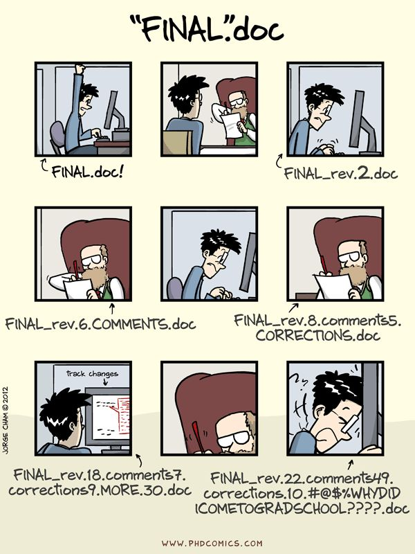
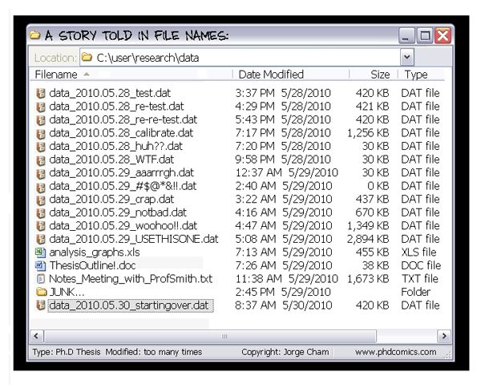
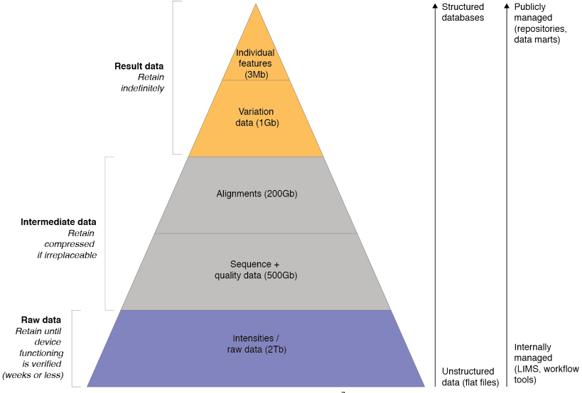

This module will show you how to manage research output going through different versions
========================================================================================
Every output of every project, whether a manuscript, some data, or an analytical workflow goes through an unpredictable number of versions. Whatever you call the "final" version never is - and you will be happiest accepting this and developing a way of working and collaborating that accommodates change at every stage while keeping specific versions of what you are working on uniquely identifiable. Here we will consider some general principles that apply to the process of version changes and identifiability in scholarly publishing, research data sets, and software code.

Manuscript versioning
---------------------

_Example 1 (v1) - Manuscript versioning ([PhD comics](http://phdcomics.com/comics/archive.php?comicid=1531))_

Even before a manuscript has been submitted for its first round of [peer review](../PUBLISHING#peer-review) it has generally gone through [a disheartening number of versions](#v1). If you are writing a manuscript in a program such as Microsoft Word, you will want to come up with a sensible file naming scheme that is infinitely expandable and allows you to identify what the latest was that you and your collaborators were working - without temping fate by calling it `latest.doc` or `final.doc`. Instead, you probably want to adopt a system where the different versions of the manuscript are prefixed with the version's date in simple [ISO8601](https://en.wikipedia.org/wiki/ISO_8601) format (i.e. YYYY-MM-DD), so that the most recent version comes to the top of a folder when you sort file names numerically.
 
Subsequently, if you send a version around for review to your collaborator, it is more or less conventional to have them insert their changes using the "track changes" facility (which gives edits made by others a different colour and allows you to decide whether to accept or reject those changes) and return the file to you with a suffix to identify the collaborator by their initials. For example: `manuscript.doc` would then become `2017-06-22-manuscript.doc`, and the version returned by your contributor would be `2017-06-22-manuscript-RAV.doc`. Note that this returned version still matches the date of the version that you sent around, even though `RAV` probably made you wait for weeks. If you have just one collaborator you might then continue with the returned version, accept or reject the changes, and rename it with the date of the new version. If you have multiple collaborators, there is a facility for "merging" documents, which you will need to do iteratively starting from the version you sent out, merging the changes made by the collaborators one by one. With some luck, the merger of all collaborators still makes enough sense so that you can then work through it and accept or reject each of the suggested changes.

### Cloud solutions for collaborative writing 
Needless to say, the off-line way of managing change in a Word is not very satisfying. Numerous approaches exist for collaborating on manuscripts "in the cloud" instead, but each has its own advantages and drawbacks. At time of writing, the following approaches can be helpful at least in some stages of manuscript drafting:

- [Google Docs](http://docs.google.com) - allows multiple people to collaborate on the same document at the same time. Each contributor can either edit directly or suggest changes that are then accepted or rejected by an editor. The main downside of Google Docs is that its manuscript editing capibilities are not sufficient for scholarly publications: there is no good way to insert citations and format bibliographies automatically (as we discuss in the section on [literature study](../LITERATURE_STUDY)), and some of the facilities for formatting text and mathematical formulas are insufficient.
- [DropBox](http://dropbox.com) - recently, Microsoft Word has got better at interacting with DropBox, so that manuscripts that are being edited simultaneously no longer tend to explode in a collection of mutually conflicting copies. That said, this approach still requires all collaborators to have roughly the same version of Word on their computer (a collaborator who uses OpenOffice to work on the manuscript instead will be disastrous) as well as the same reference management software.
- [GitHub](https://github.com) - the `git` protocol, discussed in more detail below, was developed for [collaborative software development](../SCIENTIFIC_SOFTWARE). The most popular website to facility this protocol is GitHub, which allows you to collaborate on any plain text file. Therefore, if you are able to agree with your collaborators on a text format that can be turned into a document format (like PDF) that may be acceptable to others, this may be a useful way of working. However, most plain text formats for editing and formatting text are either not suitable for scholarly manuscripts (for example, the [MarkDown](https://en.wikipedia.org/wiki/Markdown) format, which was used to develop the text you are reading now, cannot handle in-text citations automatically, so we had to develop a [workaround](../LITERATURE_STUDY#a-real-world-example-of-literature-management) for this) or likely too complicated for some of your collaborators, like [LaTeX](https://en.wikipedia.org/wiki/LaTeX)).
- [Overleaf](http://overleaf.com) - this is a web interface for editing LaTeX documents. It can do anything you need it to do to draft a scholarly manuscript, such as handling [bibtex](https://en.wikipedia.org/wiki/BibTeX) citations, mathematical formulas, vector drawings, complex tables, etc. The one downside is that many of your collaborators will find the syntax too daunting to deal with.

What all these systems have in common is that they have facilities for stepping through the revisions of a document, and the contributions made by collaborators, for the entire history of a manuscript. This is very hard to accomplish when you collaborate by emailing manuscript versions around.

Data versioning
---------------

_Example 2 (v2) - Data versioning ([PhD comics](http://phdcomics.com/comics/archive.php?comicid=1323))_

Through the course of a [computational analysis](WORKFLOWS), research data will go through a number of steps that might cause the data to be converted in different formats, reduced, filtered, and so on. Therefore, unlike what is shown in [example 2](#v2), at least some of the principles for file naming discussed previously for manuscript versions ought to be used here as well. That said, data changes enacted by computational analytical steps are not (and should not) be acts of creation where something (like a well written, complete manuscript) grows out of nothing. In a sense, the information is already there, it just needs to be extracted out of the data.

[Example 3](#v3) shows the volume reductions and types of information that are extracted and disseminated during the course of a "typical" analysis of next generation sequencing data. Here, too, a research product - in this case, sequencing reads - will go through many versions that will need to be tracked sensibly. However, these data versions should be the output of automated steps that can be re-run at will. As such, it is not the data changes themselves that are enacted by human hands, but rather, this is true of the analytical workflow, which will grow and improve over the course of the study (sometimes, a very creative process). If this is done dilligently, it should be possible to delete all but the initial, raw data to re-create everything else leading up to the result data. It should be obvious that this approach is virtuous in a number of ways:

- The [reproducibility](../REPRODUCIBILITY) of the research output is improved and the [provenance trail](../DATA_CAPTURE) of the data is recorded automatically.
- The need to develop a versioning system for intermediate data is lessened. These data become, in a sense, ephemeral - because they can be re-generated.
- There is less storage space needed for different versions of intermediate data.

_Example 3 (v3) - NGS data reduction and conversion ([gcoates](http://www.slideshare.net/gcoates/sharing-data-sanger-experiences))_

### Versioning public database records
Assuming sensible result data have been extracted, these will at some point be published in public repositories. Sometimes, this will be in a database for a specific research domain (like a DNA sequence database that issues public [accession numbers](https://support.ncbi.nlm.nih.gov/link/portal/28045/28049/Article/500/)), other times, this will be a more generic repository for research data, such as [Dryad](http://datadryad.org/), [Zenodo](https://zenodo.org/) or [FigShare](http://figshare.com). Once deposited in any of these places, data versioning becomes a much bigger issue: if something is changed about a public data record, this needs to be unambiguously clear to anyone else using these data. Therefore, all these repositories have policies for data versioning. 

Ever since GenBank abandoned the GI for sequence data, their only identifier is the accession number, which is structured as a string of letters and numbers ending in a period followed by the version number. In the case of Dryad, Figshare and Zenodo, their [respective](http://wiki.datadryad.org/Track_Version_Changes)[versioning](https://support.figshare.com/support/solutions/articles/6000079064-can-i-edit-my-research-after-it-has-been-made-public-)[policies](https://blogs.openaire.eu/?p=2010) likewise state that for every change to deposited data a new identifier is minted (which, for all three of these repositories, is a DOI).

Software versioning
-------------------

_Example 4 (v4) - Software versioning ([XKCD](https://xkcd.com/1296/))_

Software development is an exercise in managing complexity that expands gradually beyond the point where it still fits into any single person's head. Whereas it is unlikely that the introduction of a flawed turn of phrase in a manuscript can invalidate the whole text without being noticed, this is possible in software code. As such, changes need to be managed very carefully and need to be reversible - potentially even months down the line. To this end, numerous different [version control](https://en.wikipedia.org/wiki/Version_control) systems have been developed. 

What all version control systems have in common is that they provide an essentially unlimited undo for managed folder structures with text files in them. The, at present, most popular of these systems, `git`, was initially developed for the community process by which the kernel of the Linux operating system is modified. As such, this system has as an especially useful feature the ability to collaborate in a distributed fashion on multiple so-called "clones" of managed folder structures (often called "repositories") in such a way that the modifications made by different people can be mixed and matched intelligently.

Because `git` is an open source protocol, it can be freely adopted and facilitated by anyone that chooses to do so. The most popular service to do so is [GitHub](http://github.com). In recent years it has gained great popularity, not just for collaboratively managing software source code versions, but also (as noted above), plain text manuscript files and small data files. In fact, the materials you are navigating now (text, images, PDFs, and so on) are also being assembled and developed collaboratively in a repository on GitHub. 

As an exercise, have a look at [this change](https://github.com/Pfern/RODS17/commit/d16e088) to the repository of these materials. You can see the exact line difference between two versions of the document. You can also see a link to the "parent" of the current change, and if you click on that, the grandparent, and so on, all the way to the beginning of the file. These detailed, unlimited undo is just one of the advanges of using this system: the `git` protocol and the extra facilities provided by GitHub are very flexible and far-ranging. To learn more about the specific application of these tools in biology, here is a publication you might find useful:

<!-- added to Mendeley -->
**Perez-Riverol, Y. et al.** 2016. Ten simple rules for taking advantage of Git and GitHub.
_PLoS Computational Biology_ 12(7):e1004947 [[pdf](Ten_simple_rules_for_taking_advantage_of_Git_and_GitHub.PDF)]
doi:[10.1371/journal.pcbi.1004947](http://doi.org/10.1371/journal.pcbi.1004947)

### Version numbers
Managing software source code (and other files) in a version control system such as `git`, and taking advantage of the additional facilities for continuous integration, automated testing, and collaborating in the open source spirit (as discussed in the section on [software development](../SCIENTIFIC_SOFTWARE)) are good practices that will increase the likelihood of bringing a software project to a version that can be released. At this point, a similar need for the unambiguous and unique identification of versions as we saw in the versioning of manuscripts and data arises. It is certainly possible to use a `git` version string such as `d16e088` for this, but it will be hard to remember and not very informative. 

Instead, it is more or less conventional in software development to release software with a shorter version number. This is perfectly compatible with systems such as `git`, because such version numbers can be used as aliases for the opaque version strings that `git` generates internally. One of the commonly used public version number systems for software is [semantic versioning](http://semver.org/), which consists of three integers separated by periods (e.g. `1.8.23`) that are interpreted from left to right as:

1. MAJOR version number, which, when incremented, indicates that the new version is incompatible with the previous version.
2. MINOR version adds functionality in a backwards-compatible manner, and
3. PATCH version when backwards-compatible bug fixes are performed.

Whichever version numbering scheme for software is adopted, it is of vital importance in [computational workflows](../WORKFLOWS) and [reproducibility](../REPRODUCIBILITY) that version numbers are issued consistently by software authors and recorded in sufficient detail by software users.

Accomplishments
---------------
You have now learned about some of the considerations involved in managing changes in research output in such a way that every changed version can still be unambiguously identified. You should now be able to:
- Manage collaborative writing of manuscripts using Microsoft Word
- Make an informed choice between different cloud solutions for writing
- Understand the role of automation in managing change in data
- Know what happens to published data, and its identifier, if it is changed
- Understand some of the applications of version control systems
- Understand some of the considerations in software versioning
