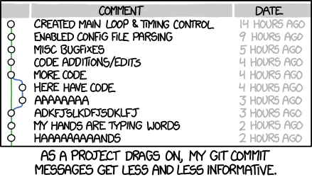

This module will show you how to manage research output going through different versions
========================================================================================
Every output of every project, whether a manuscript, some data, or an analytical workflow
goes through an unpredictable number of versions. Whatever you call the "final" version
never is - and you will be happiest accepting this and developing a way of working and
collaborating that accommodates change at every stage while keeping specific versions
uniquely identifiable. Here we will consider some general principles that apply to the 
process of version changes and identifiability in scholarly publishing, research data 
sets, and software code.

Manuscript versioning
---------------------

_Example 1 (v1) - Manuscript versioning ([PhD comics](http://phdcomics.com/comics/archive.php?comicid=1531))_

Even before a manuscript has been submitted for its first round of formal review it has 
generally gone through [a disheartening number of versions](#v1). If you are writing a
manuscript in a program such as Microsoft Word, you will probably want to adopt a system
where the different versions of the manuscript are prefixed with the version's date in simple 
[ISO8601](https://en.wikipedia.org/wiki/ISO_8601) format (i.e. YYYY-MM-DD), so that the 
most recent version comes to the top of a folder when you sort file names numerically.
 
Subsequently, if you send a version around for review to your collaborator, it is more or
less conventional to have them insert their changes using the "track changes" facility (which
gives edits made by others a different colour and allows you to decide whether to accept or
reject those changes) and return the file to you with a suffix to identify the collaborator
by their initials. For example: `manuscript.doc` would then become `2017-06-22-manuscript.doc`,
and the version returned by your contributor would be `2017-06-22-manuscript-RAV.doc`. Note 
that this returned version still matches the date of the version that you sent around, even
though `RAV` probably made you wait for weeks. If you have just one collaborator you might
then continue with the returned version, accept or reject the changes, and tag it with the
date of the new version. If you have multiple collaborators, there is a facility for "merging"
documents, which you will need to do iteratively starting from the version you sent out, merging
the changes made by the collaborators one by one. With some luck, the merger of all collaborators
still makes enough sense so that you can then work through it and accept or reject all 
suggested changes.

Needless to say, this way of managing change in a manuscript is not very satisfying. Numerous
approaches exist for collaborating on manuscripts "in the cloud" instead, but each has its
own advantages and drawbacks. At time of writing, the following approaches can be helpful at
least in some stages of manuscript drafting:

- [Google Docs](http://docs.google.com) - allows multiple people to collaborate on the same
  document at the same time. Each contributor can either edit directly or suggest changes
  that are then accepted or rejected by an editor. The main downside of Google Docs is that
  its manuscript editing capibilities are not sufficient for scholarly publications: there is
  no good way to insert citations and format bibliographies automatically (as we discuss in 
  the section on [literature study](../LITERATURE_STUDY)), and some of the facilities for
  formatting text and mathematical formulas are insufficient.
- [DropBox](http://dropbox.com) - recently, Microsoft Word has got better at interacting with
  DropBox, so that manuscripts that are being edited simultaneously no longer tend to explode
  in a collection of mutually conflicting copies. That said, this approach still requires all
  collaborators to have roughly the same version of Word on their computer (a collaborator 
  who uses OpenOffice to work on the manuscript instead will be disastrous) as well as the
  same reference management software.
- [GitHub](https://github.com) - the `git` protocol, discussed in more detail below, was 
  developed for [collaborative software development](../SCIENTIFIC_SOFTWARE). The most 
  popular website to facility this protocol is GitHub, which allows you to collaborate on 
  any plain text file. Therefore, if you are able to agree with your collaborators on a text
  format that can be turned into a document format (like PDF) that may be acceptable to others,
  this may be a useful way of working. However, most plain text formats for editing and
  formatting text are either not suitable for scholarly manuscripts (for example, 
  [MarkDown](https://en.wikipedia.org/wiki/Markdown), which was used to develop the text you
  are reading now, cannot handle in-text citations automatically) or likely too complicated
  for some of your collaborators, like [LaTeX](https://en.wikipedia.org/wiki/LaTeX)).
- [Overleaf](http://overleaf.com) - this is a web interface for editing LaTeX documents. It 
  can do anything you need it to do to draft a scholarly manuscript, such as handling 
  [bibtex](https://en.wikipedia.org/wiki/BibTeX) citations, mathematical formulas, vector
  drawings, complex tables, etc. The one downside is that many of your collaborators will 
  find the syntax too daunting to deal with.

Assuming you have figured out a way to work with your collaborators to draft a manuscript
into a state you all agree is ready to be sent out into the world, the next question is then
where it will go. It is becoming increasingly common in more and more of the natural sciences
to send a manusript to a [preprint](https://en.wikipedia.org/wiki/Preprint) server. This will
be the first version that is identifiable on the web and that will likely be assigned a 
[digital object identifier](https://en.wikipedia.org/wiki/Digital_object_identifier) or DOI.

Subsequently, you might submit your manuscript for peer review, and, finally, for publication
in a journal. The review cycle will result in more "private" versions of your manuscript:
versions that are annotated by the reviewers, versions by your collaborators to address the
reviewer comments, a version that you send back to the editor. This might happen multiple 
times. Finally, upon acceptance, you will be sent page proofs to correct (to make sure 
the manuscript will look correct in print). You will then sent back that version with any
required corrections, and then the manuscript will be "actually" published.

If you uploaded an earlier version to a preprint server, you will now need to make sure that
people using the DOI of that preprint version will be able to locate the "final" version.
This might mean that the record on the preprint server will need to be updated to point to
the "final" DOI. The cumbersome nature of the scholarly publishing cycle, with potentially 
many versions floating around on cloud services, preprint servers, indexing databases and
publisher websites, demonstrates the need for clear, unambiguous, globally unique 
identifiability of manuscripts. The DOI was invented for this purpose, and tools such as
reference managers (e.g. Mendeley) make use of it to locate the "correct" metadata associated
with this article. The most important of these metadata is Your Name, because only if you are
also uniquely identifiable will you get credited (e.g. cited) for your work (this is one of
the reasons why systems such as [ORCID](https://en.wikipedia.org/wiki/ORCID) are in usage).

Data versioning
---------------

_Example 2 (v2) - Data versioning ([PhD comics](http://phdcomics.com/comics/archive.php?comicid=1323))_

Software versioning
-------------------

_Example 3 (v3) - Software versioning ([XKCD](https://xkcd.com/1296/))_

Accomplishments
---------------
