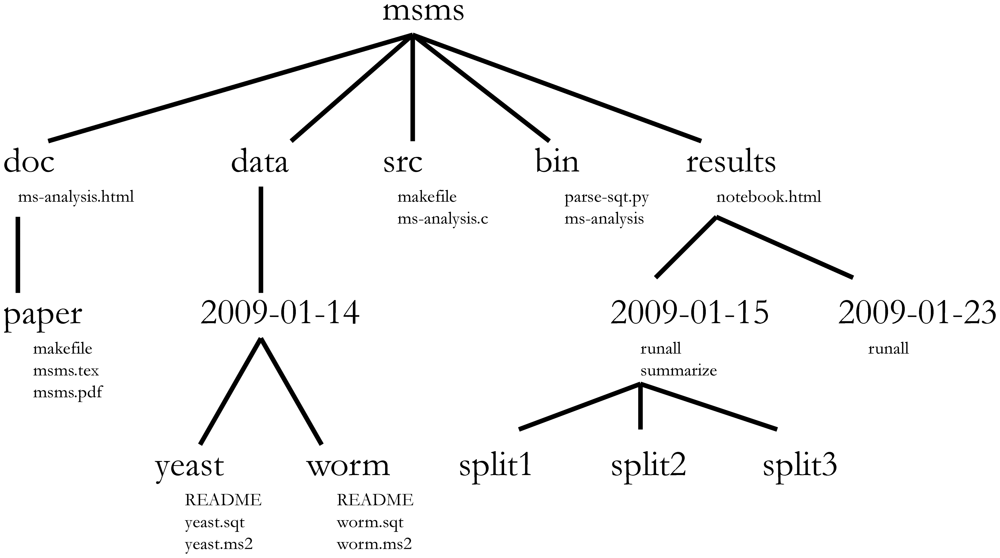
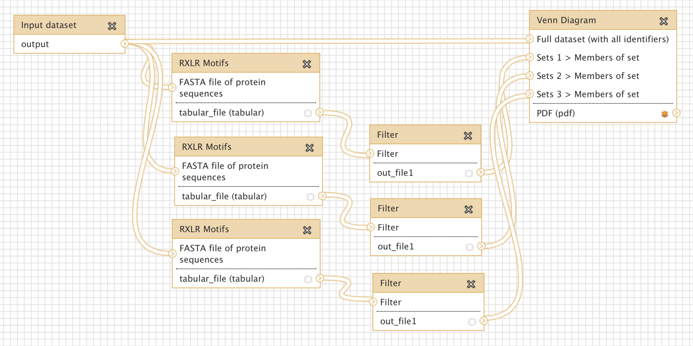

This module will show you how to do computational analyses in a reproducible and re-usable manner
=================================================================================================
Virtually no research project of interest that includes _in silico_ analysis only uses a single software tool, operating on a single data set, under a single set of parameters. There will be iterations over data sets, sweeps over parameter ranges, and multiple software tools will be used. These are all operations whose [reproducibility](../REPRODUCIBILITY) is every bit as vital as that of a wet lab procedure. Therefore, the haphazard and manual chaining together of computational analyses is a recipe for failure. In addition, because research is usually exploratory such that the right approach only becomes clear after many failed attempts (["everything you do, you will probably have to do over again"](../REFERENCES#Noble2009)), manual repetition becomes boring and error prone. Hence, computational analysis should be viewed and organised as a workflow that is automated as much as possible so that it can be re-run at will and shared with collaborators as well as the wides research community. Here we will consider some of the practical approaches and considerations in developing computational analysis workflows.

Organising a computational analysis
-----------------------------------

A computational analysis workflow chains [software tools](../SCIENTIFIC_SOFTWARE) together in a series of steps that operate on [data](../DATA_CAPTURE). Although each analysis will be different, some common file types (source code, compiled executables, data files, configuration files, etc.) are usually involved. Hence, a common project organisation such as shown in [example 1](#w1) can probably be applied. Adopting such a scheme will result in a predictable, self-documenting structure that you can easily pick back up even if you return to a project months later. In this example, the basic layout is as follows:

- **doc** - contains documentation files leading up to a scholarly manuscript
- **data** - data files and metadata (i.e. data about data, here as README text files)
- **src** - source code for compiled executables
- **bin** - compiled executables and scripts (i.e. the [$PATH](https://en.wikipedia.org/wiki/PATH_(variable)) for the workflow)
- **results** - outcomes of analysis steps

Some of these folder names match those in UNIX-like operating systems (such as Linux) and play roughly the same role. This is, of course, no coincidence - but rather a mnemonic aid. To read more about the reasoning underlying this project structure, consult [[Noble2009](../REFERENCES#Noble2009)] (where this layout came from).

Workflow tools
--------------
As we noted above, a computational analysis workflow chains tools together. Such chaining is best not done by hand because manual operations increase the chances that commands will be executed subtly different from one workflow execution to the next. For example, you might forget to set a certain parameter to the right value, or go with program defaults that make the output unpredictable from one execution to the next. The latter is for example the case with the "random number seed", i.e. the initial value for the random number generator (which is used for algorithms such as proposal mechanisms in certain Bayesian statistical analyses), which typically uses the computer's clock to generate an input value if it is not set explicitly. Hence, it is best to specify this yourself, where possible. To automate such parameter specification and chaining of workflow steps, numerous options exist. Here are some of the obvious, commonly used ones:

- **shell scripting** - on most operating systems (also on Windows), programs can be invoked on the command line shell, and these same invocations can be stored in a text file that can thus execute a series of program operations automatically. On many operating systems, shell programming is flexible enough to accommodate simple conditionals ("do this if that is true") and loops ("do this for all files"), which could easily be all you need if all the complex logic is encapsulated with the software tools you are using. A very good guide for shell scripting on OSX and UNIX-like operating systems is [here](http://tldp.org/LDP/abs/html/).
- **make tools** - one step up in terms of syntax is to use tools like [make](https://en.wikipedia.org/wiki/Make_(software)). Originally developed for compiling software, `make` (and tools like it) also issue invocations on the command line, but they are more intelligent in handling dependencies between steps (i.e. step B can only be invoked if step A has completed successfully) and allow you to label intermediate steps so that you can run a specific command defined somewhere in a larger input file for `make`, called a `Makefile`. This allows you to work incrementally, so that the output of one step can be checked before moving on to the next.
- **scripting languages** - a number of open source, general purpose scripting languages exist that can both invoke other programs on the command line, and do complex operations on data themselves. These languages include [Python](https://www.python.org/), [Perl](https://www.perl.org/) and [Ruby](https://www.ruby-lang.org/en/). More domain specific and originally geared towards statistics is the [R](https://www.r-project.org/) programming language, which can also be used to chain software tools together. Although these languages are a departure from familiar command line syntax, they are extremely flexible, well documented, and have large, helpful user bases. It is a very useful skill to pick up at least one of them.
- **literate programming environments** - as discussed in more detail in the section on [scientific software](../SCIENTIFIC_SOFTWARE), several environments exist that allow you to mix prose, visualisations and programming logic. Although these are more specialised tools as opposed to general scripting languages, the ability to document workflow logic in prose, operate incrementally and include visualisations is extremely useful.
- **visual workflow tools** - touted as a way to build complex computational analysis workflows without having to write any code, several visual workflow tools are also available. [Example 2](#w2) shows the visual workflow interface of [Galaxy](https://galaxyproject.org/). The advantage of these tools is that, indeed, analysis steps can be enacted with mouse clicks. The disadvantage is that to enable this kind of "button-press bioinformatics", the underlying code to make the right invocations still needs to be written by _someone_, so these tools are not very flexible or innovative. They are very good for standard operating procedures in labs, but not as much for novel research.

Sharing and re-use
------------------
Like all the text files that you invest a lot of time in to develop, the files associated with a computational analysis workflow should be [versioned](../VERSIONING). But, is a version control system such as [GitHub](http://github.com) also a useful way to share and distributed workflows? Perhaps not: workflows can have so many different dependencies that a faithful reproduction of the entire workflow environment on a new computer may be a daunting task. Consider, for example, the [SUPERSMART](http://www.supersmart-project.org) pipeline. It depends on a multitude of tools for DNA sequence analysis and phylogenetic inference (`muscle`, `blast+`, `phyml`, `examl`, `exabayes`, `raxml`, `treepl`, `mafft`, `beast`, and a variety of packages for R and Perl) as well as more generic Linux tools (`sqlite3`, `wget`, `curl`, various build tools, and so on). Installing all of these by hand is prohibitive for most potential users. Luckily, several solutions exist to package workflows and all their dependencies for sharing with others:

- **virtualisation** - computers have grown powerful enough, and software emulation clever enough, that one or more operating systems can be run inside another: virtualisation. Using such technology, workflow developers can start from a fresh, virtualised operating system, install the entire workflow and all its dependencies on it, and then package and distributed that virtualised operating system as a [disk image](https://en.wikipedia.org/wiki/Disk_image). The result is a rather large file (because it is an entire OS) that users can launch on their local computers as a [virtual machine](https://en.wikipedia.org/wiki/Virtual_machine) using tools such as [VirtualBox](https://www.virtualbox.org) or [VMWare](https://www.vmware.com/), or "in the cloud", e.g. on an installation of [openstack](https://www.openstack.org/) maintained by an institution or at a commercial provider of cloud computing such as [AWS](https://aws.amazon.com/).
- **containerisation** - a more lightweight solution for bundling tools that are otherwise difficult to install is offered by "containerisation". Here, the idea is that a lot of the standard components bundled in a virtual machine are actually redundant because the host operating system within which the virtual machine is run has these components as well. Hence, a more lightweight solution can be arrived at by only packaging the non-standard components of a workflow environment into a "container", e.g. as implemented in [Docker](https://www.docker.com/). Note, however, that there has to be tighter relationship between the host operating system and the container (because they share more components), so this approach works best on Linux hosts. Also, there is more potential for security risks than with virtual machines, so providers of compute power (such as, for example, your institutional system administrator) might be less keen to support containers.
- **provisioning** - another solution to dependency management is to define all the dependencies and the steps to their installation in a script. For example, the SUPERSMART pipeline uses a [puppet](https://puppet.com) script to [install all the dependencies](https://github.com/naturalis/supersmart/blob/master/conf/manifests/default.pp).

Accomplishments
---------------
You have now learned about computational analysis workflows and should be able to:

- Understand the value of consistent project organisation
- Know some of the options for automating steps in a workflow
- Be aware of the challenges and available solutions for sharing workflows
